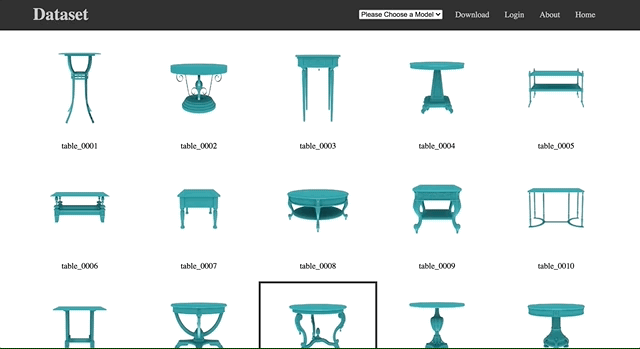
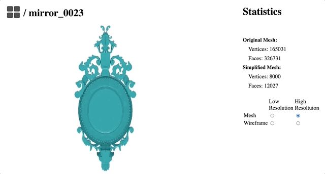

# detail-transfer

Some sample code of a website for a research project I am working on. Many sensitive parts have been changed or removed.
 
This is a project I worked on for a paper with the Interactive Graphics and Visualization Lab at UC Irvine (https://graphics.ics.uci.edu/). It has not yet been submitted, but here is a preview I made. The purpose of this project is to create a data set of 3D meshes (.ply files) of different categories of furniture using various online repositories. Then to create a machine learning algorithm that can extract artistic embellishments from one model and apply them to another. Here are some gifs from the UI of the website for this project: 

 

 For this project, I wrote many scripts that would iterate through a directory of meshes and perform operations on them. One example if this is manifold.py. In this code I create a script to run with Meshlab that removes the Non Manifold edges of a mesh. I have similiar scripts for mesh alignment and mesh simplification. 

	script = os.path.join(input_dir,"nomanifold_script.mlx")
	with open(script, "w") as file:
		file.write("<FilterScript> \n")
		file.write("<filter name=\"Remove Faces from Non Manifold Edges\"> \n")
		file.write("</filter> \n")
		file.write("</FilterScript> \n")

	command = '/Applications/meshlab.app/Contents/MacOS/meshlabserver -i ' + inp
	command += ' -o ' + out
	command += ' -s ' + script

Furthermore, here is some sample code for rendering images of several meshes. 

	cd 2dRenderFolder
	for chair_names in "${selected_models[@]}";
	do
			echo 'inside'
			echo ${chair_names}
			#generate images   
			python render_mesh.py --path="../models/doors" --mesh=${chair_names} --ni=4 --dist=2 --outf=../images --oc .10 .80 .61

	done
